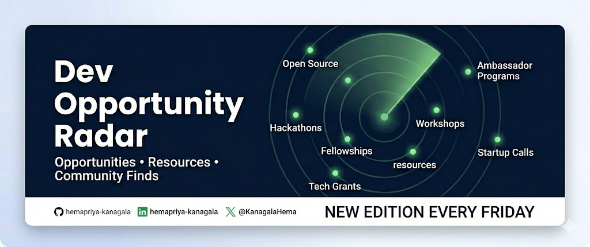

  

# Dev Opportunity Radar 

Welcome to the archive for **Dev Opportunity Radar**.

This repository serves as the home for the series, making it easy to browse previous editions, Community Finds, and useful links all in one place.

**Dev Opportunity Radar** is a weekly series where I share fellowships, grants, hackathons, startup programs, learning resources, communities, and other opportunities that developers, students, researchers, founders, and builders might otherwise miss.

The goal is simple:

**Help people discover opportunities they otherwise might have missed.**

New editions are published every Friday on DEV Community.

⭐ **If you've been enjoying the series, consider giving this repository a star.** It helps more people discover Dev Opportunity Radar, which means more people can discover opportunities they might otherwise have missed.

> 💙 **Community Finds are always welcome.** If you know about an opportunity, community, or resource that others might benefit from, I'd love to hear from you. See **[CONTRIBUTING.md](CONTRIBUTING.md)** to learn how to submit one.

---

## Latest Edition

> 📍 **Latest:** **[Dev Opportunity Radar #7: $1,000 Solo Grants, Free Claude Max for Open Source Contributors, and an MLH Hackathon](https://dev.to/devengers/dev-opportunity-radar-7-1000-solo-grants-free-claude-max-for-open-source-contributors-and-an-3i12)**

---

## Table of Contents

* [What You'll Find Here](#what-youll-find-here)
* [Series at a Glance](#series-at-a-glance)
* [Recent Editions](#recent-editions)
* [Recent Community Finds](#recent-community-finds)
* [Suggest a Community Find](#suggest-a-community-find)
* [Read the Series](#read-the-series)
* [Copyright](#copyright)

---

## What You'll Find Here

Each edition is different, but topics featured in the series commonly include:

| **Category**                     | **Examples**                                                 |
| -------------------------------- | ------------------------------------------------------------ |
| **Education & Research**      | Fellowships, Scholarships, Research Opportunities            |
| **Startups & Founders**       | Startup Programs, Founder Opportunities, Builder Residencies |
| **Career**                    | Internships, Technical Programs, Early-Career Opportunities  |
| **Community**                 | Developer Communities, Conferences, Meetups, Events          |
| **Learning**                  | Learning Resources, Courses, Books, Certifications           |
| **Challenges & Competitions** | Hackathons, AI Challenges, Competitions                      |

---

## Series at a Glance

| Metric                   | Value    |
| ------------------------ | -------- |
| Editions Published       | 7        |
| Opportunities & Resources Shared       | 30        |
| Community Finds Featured | 5        |
| Contributors Credited | 5        |
| Started                  | May 2026 |
| Publishing Schedule      | Every Friday   |

---

## Recent Editions

| Edition            | Highlights                                                                      | Published | Status  |
| ------------------ | ------------------------------------------------------------------------------- | --------- | ------- |
| [Edition #7](https://dev.to/devengers/dev-opportunity-radar-7-1000-solo-grants-free-claude-max-for-open-source-contributors-and-an-3i12) | Solo Grants, Claude for Open Source, Midnight Hackathon | July 10, 2026 | Latest |
| [Edition #6](https://dev.to/devengers/dev-opportunity-radar-6-y-combinator-startup-school-open-source-ai-grants-and-a-60k-apac-4nlp) | Y Combinator Startup School, Sentient Open Source AGI Grant Program, APAC Stellar Hackathon | July 3, 2026 | Archive |
| [Edition #5](https://dev.to/devengers/dev-opportunity-radar-5-a-fully-funded-trip-to-aws-reinvent-google-cloud-career-launchpad-and-3p6e) | AWS All Builders Welcome Grant, Google Cloud Career Launchpad, Leaders of Today Award          | June 26, 2026 | Archive  |
| [Edition #4](https://dev.to/devengers/dev-opportunity-radar-4-anthropic-fellows-30k-for-founders-and-aws-she-builds-2a6b) | Anthropic Fellows Program, LeapYear, AWS She Builds Mentorship Program          | June 19, 2026 | Archive  |
| [Edition #3](https://dev.to/devengers/dev-opportunity-radar-3-neo-scholars-a-2m-ai-challenge-and-an-85k-ai-fellowship-cjf) | Neo Scholars, Gemini × XPRIZE AI Business Challenge, Claude Corps, AI Tinkerers | June 12, 2026 | Archive |

👉 Showing the five most recent editions. For the complete archive, visit the [Edition Archive](editions.md).

---

## Recent Community Finds

One of my favorite parts of the series has been seeing readers share opportunities, communities, resources, and events that others might benefit from discovering.

| Community Find                         | Shared By     | Featured In |
| -------------------------------------- | ------------- | ----------- |
| CALEC Volunteer & Internship Opportunities | Francis | [Edition #6](https://dev.to/devengers/dev-opportunity-radar-6-y-combinator-startup-school-open-source-ai-grants-and-a-60k-apac-4nlp) |
| Hack with MLH & DigitalOcean                           | L. Cordero | [Edition #5](https://dev.to/devengers/dev-opportunity-radar-5-a-fully-funded-trip-to-aws-reinvent-google-cloud-career-launchpad-and-3p6e)  |
| AI Tinkerers                           | Julien Avezou | [Edition #3](https://dev.to/devengers/dev-opportunity-radar-3-neo-scholars-a-2m-ai-challenge-and-an-85k-ai-fellowship-cjf)  |
| Claude Corps                           | Phinn Markson | [Edition #3](https://dev.to/devengers/dev-opportunity-radar-3-neo-scholars-a-2m-ai-challenge-and-an-85k-ai-fellowship-cjf)  |
| MLH Global Hack Week: Hacking for Good | Francis       | [Edition #3](https://dev.to/devengers/dev-opportunity-radar-3-neo-scholars-a-2m-ai-challenge-and-an-85k-ai-fellowship-cjf)  |

I hope this section continues to grow over time.

👉 [View all Community Finds](community-finds.md)

---

## Suggest a Community Find

Know about a fellowship, grant, hackathon, conference, startup program, community, learning resource, or another opportunity that more people should know about?

I'd love to hear about it.

Please take a look at the **[Contributing Guide](CONTRIBUTING.md)** for the best way to submit a Community Find, along with a few tips that help me review suggestions more easily.

If your Community Find is featured in a future edition, I'll always make sure to credit you. If you discovered it, that recognition belongs to you.

---

## Read the Series

If you're looking specifically for **Dev Opportunity Radar**, this repository is the easiest place to browse every edition, Community Find, and archive in one place.

If you'd like to explore my other articles as well, you can visit my DEV profile:

👉 https://dev.to/hemapriya_kanagala

---

Thank you to everyone who reads, comments, shares opportunities, and contributes Community Finds.

A few weeks ago, this series was just an experiment.

Since then, people have discovered opportunities through the radar, applied to programs, shared Community Finds, and helped make each edition better than the last.

My hope is that this slowly becomes **our radar**, not just mine.

---

## Copyright

Dev Opportunity Radar is an original series written and maintained by Hemapriya Kanagala.

Please feel free to share links to the series. If you'd like to reuse or republish the content, please contact me first.
